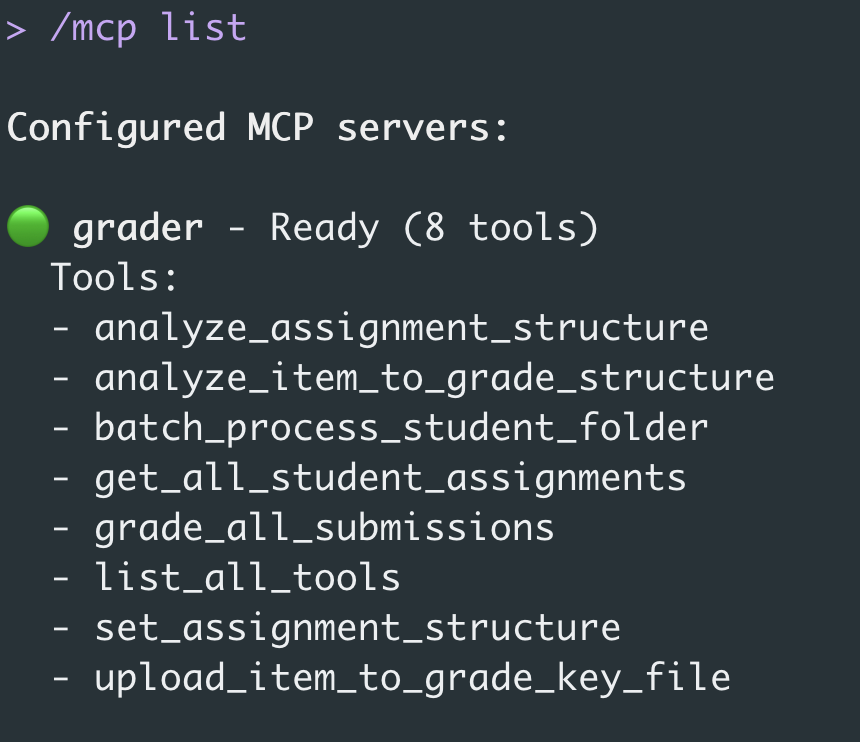
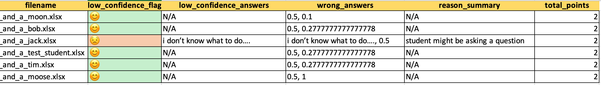

# MCP Grader — Serverless Model Context Protocol Grading System

**MCP Grader** is a serverless, AI-powered grading system built using the [Model Context Protocol (MCP)](https://modelcontextprotocol.io/) and [FastMCP](https://pypi.org/project/fastmcp/).  
It connects your LLMs (e.g., Gemini CLI or OpenAI-compatible clients) to a reproducible, deterministic grading backend that evaluates student submissions using structured data extraction, confidence scoring, and AWS DynamoDB persistence.

---

## Features

- ** Serverless MCP backend** using [FastMCP](https://pypi.org/project/fastmcp/)
- **Auto-grading** for structured and semi-structured math/statistics assignments  
  (supports `.xlsx` and `.docx` answer keys and student submissions)
- ** AWS Bedrock integration** — uses `nova-micro-v1` to extract structured Q/A JSON
- ** DynamoDB (On-Demand)** for storing templates, submissions, and grading results
- ** Confidence detection** — identifies when students might be asking for help
- ** Excel (XLSX) reports** with color-coded grading breakdown and summary sheet
- ** Batch processing** — grade entire folders of submissions automatically
- ** Cloud-ready** — deployable as a container or via AWS Lambda/Fargate

## 🏗️ Installation

Clone the repository:

```bash
git clone https://github.com/galois17/mcp-grader.git
cd mcp-grader
```

Install dependencies using uv (https://github.com/astral-sh/uv):

```bash
uv add boto3==1.40.63 fastmcp==2.13.0.2 openpyxl>=3.1.5 pandas>=2.3.3 python-docx>=1.2.0
```

Or install all at once:
```bash
uv sync
```

## AWS Setup

MCP Grader requires access to AWS Bedrock and DynamoDB:
	1.	Enable Bedrock access in your AWS account (region us-east-2).
	2.	Create or allow on-demand DynamoDB tables:
	•	AssignmentTemplatesTable
	•	GradedAssignmentsTable
	3.	Ensure your AWS credentials are available (via ~/.aws/credentials or environment variables).

The tool will auto-create both tables if they do not exist.

## Connecting MCP Grader to Gemini CLI (As of Nov 1, 2025)

Navigate to a directory different from the cloned repository. I will sue ~/tmp as an example. (Create it if it doesn't exist for you.)
```bash
cd ~/tmp
cp /path/to/mcp-grader/assets/answer_key.xlsx .
cp -a /path/to/mcp-grader/assets/student_submissions .
```

```bash
gemini mcp list
#-> No MCP servers configured.
```

```bash
gemini mcp add grader uv run --with fastmcp fastmcp run /full_path_to/mcp-grader/server.py
#-> MCP server "grader" added to project settings. (stdio)
```

```bash
gemini mcp list

✓ grader: uv run --with fastmcp fastmcp run .../mcp-grader/server.py (stdio) - Connected
```

Start Gemini:
```bash
gemini
```

<p align="center">
  
</p>


Allow the execution of the MCP tool. Then run the following 4 queries in sequence:
```bash
> Upload the answer key ~/tmp/q_and_a_answer_key.xlsx with all parameters null.
```
```bash
> Analyze the answer key using the latest template id.
```

```bash
> Now process all the student submissions in this folder: 
~/tmp/student_submissions
```

```bash
> Call the tool grade_all_submissions using the latest template ID.
The last query should result in something like this. The Excel file produced will contain the report of the grades.
```

```bash
✦ Grading is complete. The results have been saved to 
~/tmp/grading_results_faa5d7bf-5fdd-4db7-8802-af1181daa16d.xlsx.
```

The report can be found in ~/tmp/grading_results_faa5d7bf-5fdd-4db7-8802-af1181daa16d.xlsx.

<p align="center">
  
</p>